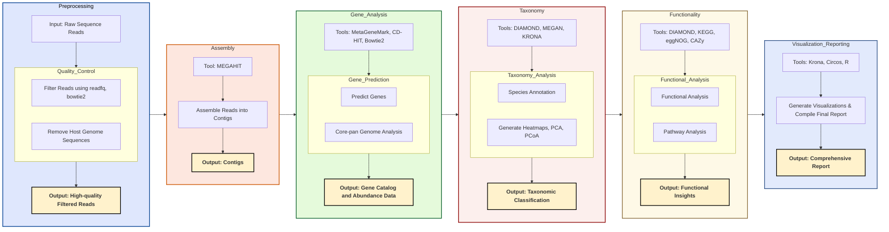

```mermaid
flowchart LR
    subgraph Quality_Control["Quality_Control"]
        QC1["Filter Reads using readfq, bowtie2"]
        QC2["Remove Host Genome Sequences"]
    end

    subgraph Preprocessing["Preprocessing"]
        direction TB
        PP1["Input: Raw Sequence Reads"]
        Quality_Control
        PP4["Output: High-quality Filtered Reads"]
    end

    subgraph Assembly["Assembly"]
        direction TB
        A1["Tool: MEGAHIT"]
        A2["Assemble Reads into Contigs"]
        A3["Output: Contigs"]
    end

    subgraph Gene_Prediction["Gene_Prediction"]
        GP1["Predict Genes"]
        GP2["Core-pan Genome Analysis"]
    end

    subgraph Gene_Analysis["Gene_Analysis"]
        direction TB
        GA1["Tools: MetaGeneMark, CD-HIT, Bowtie2"]
        Gene_Prediction
        GA4["Output: Gene Catalog and Abundance Data"]
    end

    subgraph Taxonomy_Analysis["Taxonomy_Analysis"]
        TA1["Species Annotation"]
        TA2["Generate Heatmaps, PCA, PCoA"]
    end

    subgraph Taxonomy["Taxonomy"]
        direction TB
        T1["Tools: DIAMOND, MEGAN, KRONA"]
        Taxonomy_Analysis
        T4["Output: Taxonomic Classification"]
    end

    subgraph Functional_Analysis["Functional_Analysis"]
        FN1["Functional Analysis"]
        FN2["Pathway Analysis"]
    end

    subgraph Functionality["Functionality"]
        direction TB
        FA1["Tools: DIAMOND, KEGG, eggNOG, CAZy"]
        Functional_Analysis
        FA4["Output: Functional Insights"]
    end

    subgraph Visualization_Reporting["Visualization_Reporting"]
        direction TB
        VR1["Tools: Krona, Circos, R"]
        Reporting["Generate Visualizations & Compile Final Report"]
        VR4["Output: Comprehensive Report"]
    end

    %% Connections
    PP1 --> Quality_Control --> PP4
    Preprocessing --> Assembly
    A1 --> A2 --> A3
    Assembly --> Gene_Analysis
    GA1 --> Gene_Prediction --> GA4
    Gene_Analysis --> Taxonomy
    T1 --> Taxonomy_Analysis --> T4
    Taxonomy --> Functionality
    FA1 --> Functional_Analysis --> FA4
    Functionality --> Visualization_Reporting
    VR1 --> Reporting --> VR4

    %% Highlight key outputs
    classDef important fill:#fff2cc,stroke:#000,stroke-width:2px,font-weight:bold;
    class PP4,A3,GA4,T4,FA4,VR4 important;

    %% Coloring subgraphs
    style Preprocessing fill:#dfe7fd,stroke:#003f91,stroke-width:2px,color:#000000
    style Assembly fill:#fde7df,stroke:#cc5500,stroke-width:2px
    style Gene_Analysis fill:#e5fadb,stroke:#116530,stroke-width:2px
    style Taxonomy fill:#fcefed,stroke:#8b0000,stroke-width:2px
    style Functionality fill:#fef9e7,stroke:#8a6d3b,stroke-width:2px
    style Visualization_Reporting fill:#e2eafc,stroke:#34568b,stroke-width:2px
```
